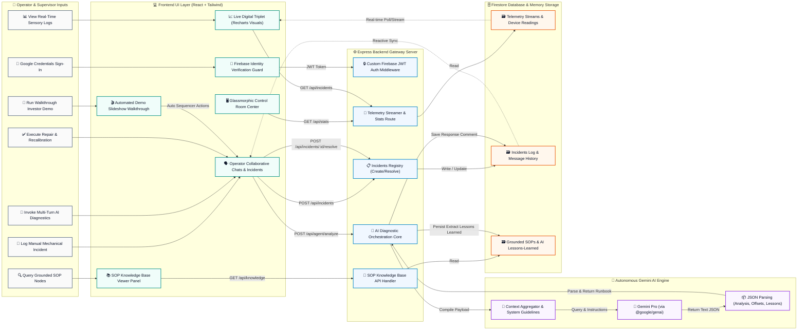
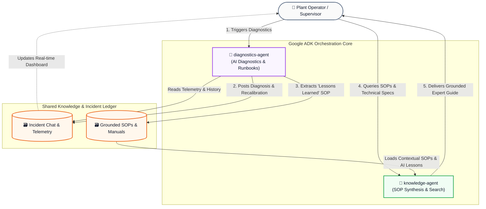

# collective-wisdom
Autonomous AI Diagnostics & Digital Triplet Control Room

[](https://nodejs.org/)
[](https://vite.dev/)
[](https://tailwindcss.com/)
[](https://firebase.google.com/)

**Collective Wisdom** is a modern, high-fidelity Autonomous AI Diagnostics & Digital Triplet control room platform designed for high-availability industrial manufacturing plants. It couples real-time sensory log monitoring, cooperative Expert Hub chats, and automated anomaly resolution runbooks utilizing Google Gemini AIs.


https://github.com/user-attachments/assets/cecd6514-b260-4c15-bcaa-2ed682b57e81


---

## 🏗️ Swimlane System Architecture

The following diagram illustrates how user actions across roles flow from inputs down into frontend layout triggers, backend endpoint execution, autonomous Gemini AI model reasoning, and persistent Firestore collections.


---

## 🤖 ADK Multi-Agent Collaboration Loop

The platform leverages two specialized AI Agents orchestrated via the **Google ADK (`@google/adk`)** library. They collaborate through a persistent feedback loop, creating an expert learning flywheel that captures on-the-floor expertise and dynamically updates the plant's operational memory.



### 🔁 Operational Flywheel Dynamics:
1. **Anomaly & Diagnosis**: When a sensory limit is breached, the operator invokes the `diagnostics-agent`. It analyzes real-time sensor metrics and outputs a precise recalibration proposal (recalibration steps, temperature offsets, safety comments).
2. **Knowledge Synthesis**: If the `diagnostics-agent` identifies a novel mechanical resolution pattern, it extracts an operational **"Lesson Learned"** as a structured summary.
3. **Database Grounding**: This lesson is automatically written as a new **Knowledge Node** in the plant's database.
4. **Contextual Grounding**: When operators ask technical questions, the `knowledge-agent` reads the global manuals along with the *newly synthesized AI lessons*, producing up-to-date, grounded troubleshooting guides in real time.

---

## ✨ Core Capabilities

*   **Google Identity Protection**: Access-restricted dashboard using Google Firebase Authentication and premium, glassmorphic login guards.
*   **Active Operator Dropdown**: Interactive navigation header displaying live Google profile details, real-time activity status, and secure signOut toggles.
*   **Digital Triplet sensory tracking**: Monitor continuous mechanical line signals (e.g. `CNV-01`, `Sens-1`) with status trackers.
*   **Cooperative Operator Feed**: Real-time expert chat feeds allowing operator-to-operator and operator-to-AI diagnosis tracking.
*   **Gemini AI Diagnosis Integration**: Invoke custom telemetry summaries, automated risk analyses, and actionable recovery recommendations via the Google `@google/genai` library.

---

## 🛠️ Local Development

### Prerequisites
*   **Node.js 22 LTS** or newer
*   **Google Cloud SDK (`gcloud` CLI)** — optional, but recommended for credential handling
*   A **Firebase Project** with Google Authentication and Cloud Firestore enabled

### 1. Repository Setup & Dependencies
Clone the repository and install the production/development dependencies:
```bash
npm install
```

### 2. Configure Local Environment Variables
Create a `.env` file in the project root:
```env
# Google Gemini API Access (Required for AI diagnostic operations)
GEMINI_API_KEY="your_gemini_api_key"

# Application Endpoint (used for callbacks and links)
APP_URL="http://localhost:3000"
```

### 3. Setup Database Credentials
By default, the backend connects to Cloud Firestore. 
*   **Service Account Option**: Place your downloaded Service Account key file (`collective-bento-firebase-adminsdk-fbsvc-*.json`) in the project root. The backend will automatically detect and bind to it.
*   **Application Default Credentials (ADC)**: Alternatively, log in via your local shell to automatically forward credentials to the application:
    ```bash
    gcloud auth application-default login
    ```

### 4. Running the Dev Server
Launch the unified development build (launches both the Vite frontend dev compiler and the Express API server):
```bash
npm run dev
```
Open [http://localhost:3000](http://localhost:3000) to view the live dashboard.

---

## 🧪 Testing & Code Quality

Validate TypeScript definitions, lint-rules, and compile targets:

*   **Type Check & Linting**:
    ```bash
    npm run lint
    ```
*   **Production Bundling**:
    ```bash
    npm run build
    ```

---

## 🚀 Production Deployment (Google Cloud Run & GitHub Actions)

The application incorporates a robust GitHub Actions deployment pipeline located in `.github/workflows/deploy.yml`. The pipeline automates multi-stage Docker builds, pushes the container to Artifact Registry, and deploys it to Cloud Run on pushes to the `main` branch.

### 1. GitHub Repository Variables
Configure these variables under **Settings** ➔ **Secrets and variables** ➔ **Actions** ➔ **Variables**:

*   `PROJECT_ID`: Your Google Cloud project ID (e.g., `collective-bento`).
*   `SERVICE_NAME`: The target Google Cloud Run service name (e.g., `collective-bento-service`).
*   `REGION`: The target deployment region (e.g., `us-central1`).
*   `DOCKER_IMAGE_URL`: Your Google Artifact Registry Docker image destination link (e.g., `us-central1-docker.pkg.dev/collective-bento/collective-bento-repo/collective-bento`).
*   `VITE_API_URL`: The production endpoint url of your Cloud Run instance.

### 2. GitHub Repository Secrets
Configure this variable under **Settings** ➔ **Secrets and variables** ➔ **Actions** ➔ **Secrets**:

*   `GCP_SA_KEY`: The raw text contents of your GCP Service Account JSON key file. 
    *(Requires roles: Artifact Registry Writer, Cloud Run Developer, Service Account User).*

### 3. Setting Gemini API Key on Cloud Run
To enable Gemini AI capabilities in production, set the environment variable on your Cloud Run Service:
1. Navigate to your Service on the **Cloud Run Console**.
2. Select **Edit & Deploy New Revision**.
3. Under the **Variables** tab, add a new environment variable:
   - **Name**: `GEMINI_API_KEY`
   - **Value**: *[Your active Google Gemini API Key]*
4. Click **Deploy**.
